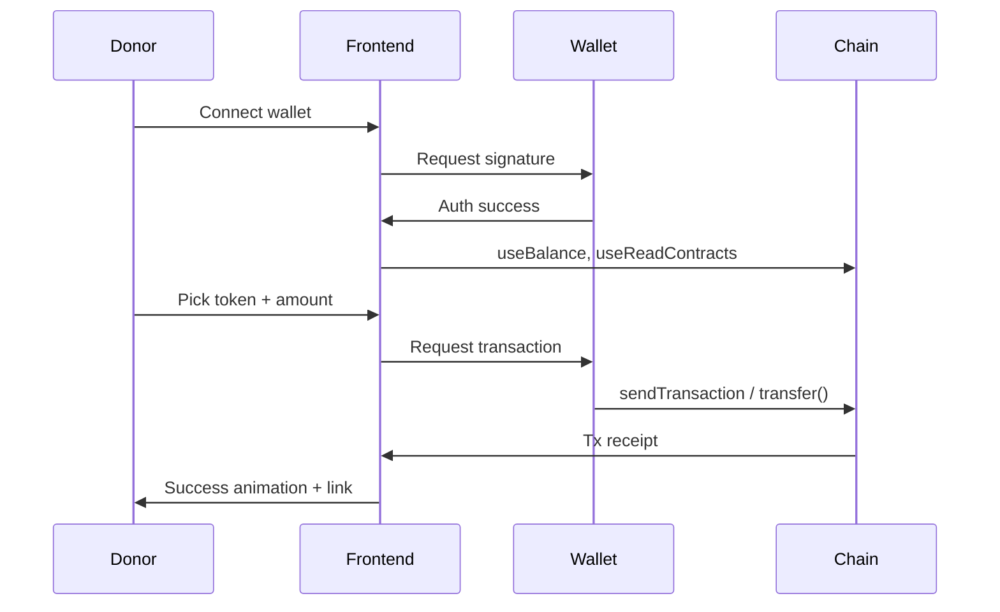

# Crypto "Buy Me a Coffee" PRD (Powered by Dynamic.xyz + MongoDB)

## Overview

Create a lightweight, user-owned crypto tipping platform that allows anyone to set up a donation page using just their wallet. Each donation page is tied to a wallet address and uniquely accessible via a slug (e.g. `/u/coffee.eth`). Users can donate native or ERC-20 tokens from any EVM-compatible network. All pages and flows are serverless except user metadata, which is stored in MongoDB.

---

## 1. Tech Stack

| Layer            | Tools                                          |
| ---------------- | ---------------------------------------------- |
| Framework        | Next.js 13+ (App Router)                       |
| Web3 Integration | Dynamic.xyz SDK, Wagmi, Viem                   |
| UI/UX            | React 18, TailwindCSS, Shadcn/UI, Lucide Icons |
| State Management | React Context or Zustand                       |
| Database         | MongoDB (via Mongoose or native driver)        |
| Hosting          | Vercel (preferred), others possible            |

---

## 2. User Flows

### A. Creator

1. Visits `/`
2. Connects wallet (Dynamic)
3. Backend checks for existing user by address

   * If not found, redirects to `/onboarding`
4. Enters display name + slug
5. Redirected to `/u/<slug>` (public page)
6. Can copy page link / log out / receive donations

### B. Supporter

1. Visits `/u/<slug>`
2. Connects wallet (Dynamic)
3. Auto-detects tokens with balances
4. Selects network, token, amount
5. Confirms tx → sees receipt + success message

---

## 3. Routing Structure (App Router)

```txt
app/
├─ layout.tsx              // Wraps with Web3Provider
├─ page.tsx                // Landing Page
├─ onboarding/page.tsx     // Profile Setup Page
├─ u/[slug]/page.tsx       // Donation Page
├─ api/create-user.ts      // Creates user entry in DB
├─ api/get-user.ts         // Gets user by slug
├─ api/slug/[slug].ts      // (SSR support for donation pages)
├─ api/donations/webhook.ts // (Optional) Alchemy or Zora webhook
└─ dashboard/page.tsx      // (Optional) Donation analytics
```

---

## 4. Component Responsibilities

### `components/web3-provider.tsx`

* Wraps app in Dynamic/Wagmi/QueryClient providers
* Sets chains, transports, and authentication mode

### `components/auth-modal.tsx`

* Wrapper for `<DynamicWidget />`
* Used in landing + donation pages

### `components/donate-button.tsx`

* Opens donation modal
* Receives recipient wallet address as prop

### `components/enhanced-donate-modal.tsx`

* Connects wallet
* Detects tokens: native + COMMON\_TOKENS via `useReadContracts`
* Allows preset + custom amounts
* Handles native and ERC-20 transfers
* Tracks tx status

### `components/copy-link-button.tsx`

* Copies the slug URL

### `components/header.tsx`

* Renders login/logout state and page actions

---

## 5. Dynamic SDK Setup

### In `web3-provider.tsx`

```tsx
<DynamicContextProvider
  settings={{
    environmentId: process.env.NEXT_PUBLIC_DYNAMIC_ENVIRONMENT_ID!,
    walletConnectors: [EthereumWalletConnectors],
    initialAuthenticationMode: 'connect-only',
    shadowDOMEnabled: true,
  }}>
  ...
</DynamicContextProvider>
```

* Chains: Ethereum, Base, Polygon, Arbitrum, Optimism, BSC
* No social login required (only wallets)

---

## 6. MongoDB Integration

### Schema (User)

```ts
{
  address: string, // wallet address
  slug: string,    // unique URL identifier
  displayName: string,
  createdAt: Date
}
```

### Schema (Donations)

```ts
{
  _id: ObjectId,
  txHash: string,
  fromWallet: string,
  toWallet: string,
  chainId: number,
  tokenAddress: string,
  amountRaw: string,   // BigInt string
  amountFormatted: string,
  createdAt: Date
}
```

### API Routes

#### POST `/api/create-user`

```json
{
  "address": "0xabc...",
  "displayName": "Coffee Dev"
}
```

→ generates slug (e.g. `coffee-dev`) and stores user

#### GET `/api/get-user?slug=coffee`

→ returns `{ address, slug, displayName }`

#### GET `/api/slug/[slug]`

→ returns `{ address, slug }` for SSR rendering

#### POST `/api/donations/webhook`

→ Accepts tx data and stores donation metadata (Alchemy/Zora webhook)

---

## 7. Token Discovery (Frontend)

1. Detect native balance via `useBalance`
2. Batch `balanceOf` on common tokens:

   * Use `useReadContracts`
   * Reference `COMMON_TOKENS[chainId]`
   * Filter for balances > 0

Optional enhancement:

* Fetch TokenLists
* Let user paste token address (on-demand fetch metadata)
* Use backend indexer (Alchemy, Zora) for a fallback scan

---

## 8. Donation Logic

| Token Type | Hook                 | Notes                               |
| ---------- | -------------------- | ----------------------------------- |
| Native     | `useSendTransaction` | Sends `value` to `recipientAddress` |
| ERC-20     | `writeContract`      | Calls `transfer(address, amount)`   |

Also use `useWaitForTransactionReceipt` for feedback + receipt link.

---

## 9. Enhanced Modal UX

* Shows connected chain + balance
* Renders token selector w/ logos
* Shows preset + custom input
* Confirms + animates on success
* Explorer link shown after tx
* Shows gas fee warning if ERC-20

---

## 10. Edge Case Handling

| Case                    | Behavior                                          |
| ----------------------- | ------------------------------------------------- |
| Not connected wallet    | Shows Dynamic connect modal                       |
| Wallet on wrong network | Warn and allow network switch                     |
| No tokens found         | Show fallback + info message                      |
| Insufficient balance    | Show warning and disable donate button            |
| Tx error (user denied)  | Friendly message: "Transaction cancelled by user" |
| Slug not found          | Return 404 or fallback page                       |

---

## 11. Security Considerations

| Risk                  | Mitigation                                      |
| --------------------- | ----------------------------------------------- |
| Slug squatting        | Only allow one slug per address; sanitize input |
| Replay attacks        | No backend signatures; use client-side tx only  |
| XSS in profile fields | Escape output in display name, ENS, etc.        |
| Spoofed links         | Slugs mapped to checksum addresses              |
| Secrets exposure      | Keep API keys out of frontend code              |

---

## 12. Sequence Diagram



---

## 13. Testing and Dev Setup

### `.env.local`

```
NEXT_PUBLIC_DYNAMIC_ENVIRONMENT_ID=xxx
MONGODB_URI=mongodb+srv://...
```

### Start project

```bash
npm install
npm run dev
```

---

## ✅ MVP Definition of Done

**Creator Requirements**

*

**Supporter Requirements**

*

**System Requirements**

*

---

## 🌱 Optional Enhancements (Post-MVP)

* Donation history via MongoDB or chain indexer
* Embedded donation widget (iframe)
* Top donors leaderboard
* Theme customization for creator pages
* ENS resolution for address slugs
* Smart account sponsorship for donors

---

## 🔗 References

* Dynamic SDK: [https://docs.dynamic.xyz](https://docs.dynamic.xyz)
* Wagmi Docs: [https://wagmi.sh](https://wagmi.sh)
* Viem Docs: [https://viem.sh](https://viem.sh)
* MongoDB Driver: [https://www.mongodb.com/docs/drivers/node](https://www.mongodb.com/docs/drivers/node)

---

Let me know if you want the Next.js codebase scaffolded with this structure or a README template!
